# "Investigating with Splunk" - TryHackMe Challenge

We will be working on a closed environment using only Splunk provided with already harvested logs. Scenario goes as follows

> SOC Analyst Johny has observed some anomalous behaviours in the logs of a few windows machines. It looks like the adversary has access to some of these machines and successfully created some backdoor. His manager has asked him to pull those logs from suspected hosts and ingest them into Splunk for quick investigation. Our task as SOC Analyst is to examine the logs and identify the anomalies.

## Q1: How many events were collected and Ingested in the index main?

We know that our log index is called "main" and we just need to extend timeline to cover all entries.

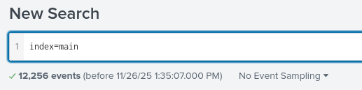

The answer is:
> 12256

## Q2: On one of the infected hosts, the adversary was successful in creating a backdoor user. What is the new username?

New user was created and logs are collected from windows os. Windows logs event id for user creation is 4720.

Searching for
``
index=main EventID="4720"
``
gave us one hit

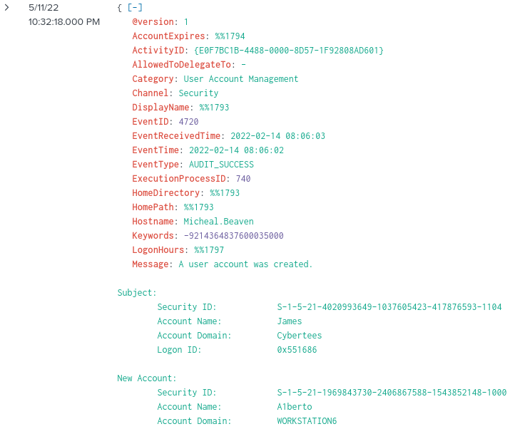

Newly created account name is:
> A1berto

## Q3: On the same host, a registry key was also updated regarding the new backdoor user. What is the full path of that registry key?

I am not that familiar with Event ID's yet, so a quick search reveals that **ID=13** identifies Registry Value Set (source: [www.ultimatewindowssecurity.com](https://www.ultimatewindowssecurity.com/securitylog/encyclopedia/event.aspx?eventid=90013)). Searching for ```index=main EventID="13" | search A1berto```

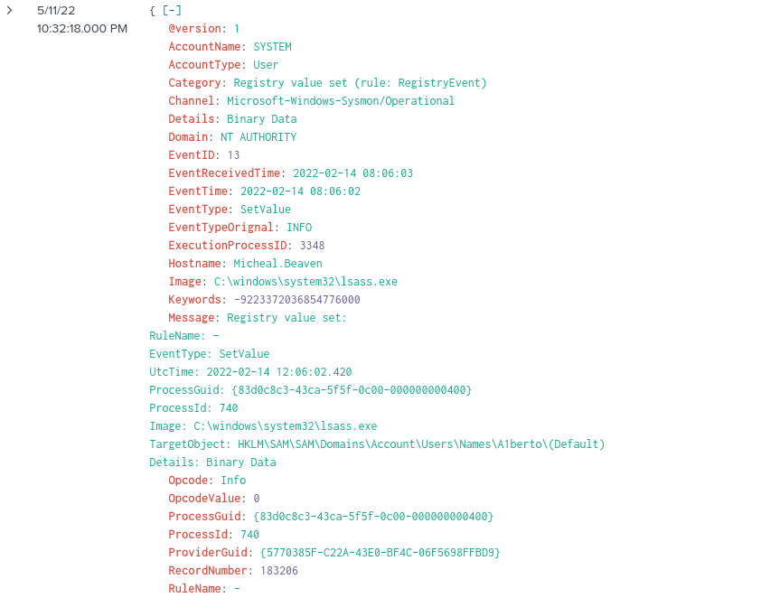

Full path of registry key is

> HKLM\\SAM\\SAM\\Domains\\Account\\Users\\Names\\A1berto\\

## Q4: Examine the logs and identify the user that the adversary was trying to impersonate

When i look for other users from selected fields we can see that adversary cleverly changed letter **l** to **1**.

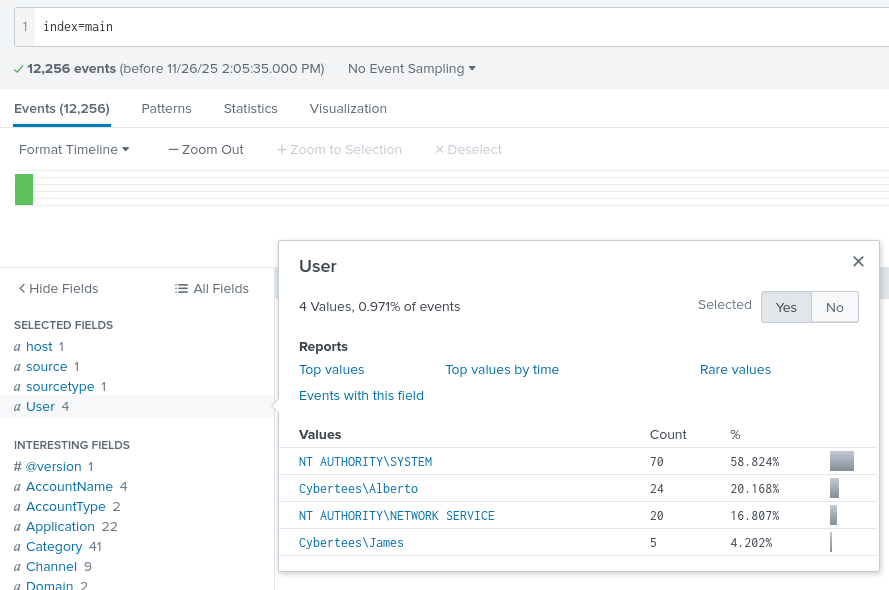

Answer is

> Alberto

## Q5: What is the command used to add a backdoor user from a remote computer?

In order to add a user, some kind of command was executed via a windows process.

* Process creation ID is 4688
* Backdoor user's name is Alberto

Based on the above points let's start with a query `index=main EventID="4688" | search A1berto` and there we have it

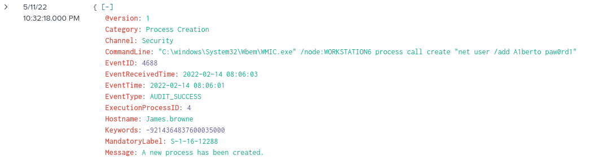

Answer is:

> "C:\\windows\\System32\\Wbem\\WMIC.exe" /node:WORKSTATION6 process call create "net user /add A1berto paw0rd1"

## Q6: How many times was the login attempt from the backdoor user observed during the investigation?

To construct this query we need:

* Windows Security Log Event ID for successful login, which is 4624 for successful login
* Windows Security Log Event ID for unsuccessful login, which is 4625
* User who tried to login: A1berto

I searched for `index=main EventID="4624" OR EventID="4625" | search A1berto`

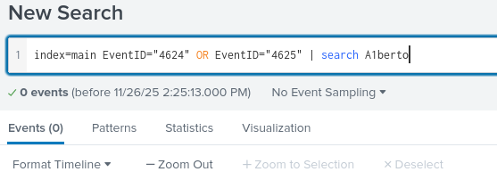

Surprisingly this is the correct number of events

> 0

## Q7: What is the name of the infected host on which suspicious Powershell commands were executed?

We can go back to Q5 and from search result. Infected Hostname which executed suspicious commands is

> James.browne

## Q8: PowerShell logging is enabled on this device. How many events were logged for the malicious PowerShell execution?

I don't know what are event IDs for PowerShell execution. Found them on [iblue.team](https://www.iblue.team/incident-response-1/logging-powershell-activities)

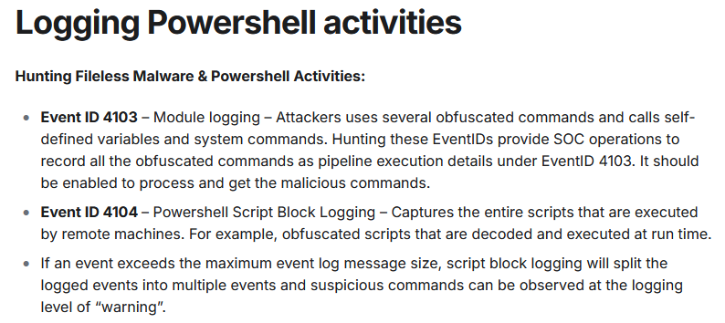

Using `index=main | search EventID="4103" OR EventID="4104"`

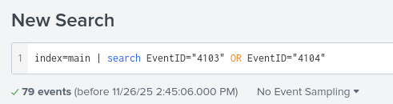

Got the answer

> 79

## Q9: An encoded Powershell script from the infected host initiated a web request. What is the full URL?

This one got me a while to figure out. Starting with a simple query and manually checking events i found the right one.

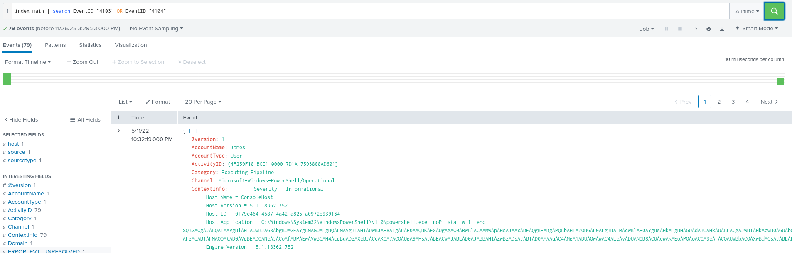

But this way of looking for it was highly unsatisfying. I digged deeper and found out on [community.splunk.com](https://community.splunk.com/t5/Splunk-Search/How-to-extract-a-text-from-a-field/m-p/261303#M78414) that it is possible to refine search query and extract

> Host Application

value with a use of `rex`. This means that i need to use regex. To help myself out i used [regexr.com](https://regexr.com/) and finally came with correct expression.

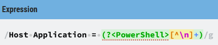

I also removed duplicates and visualizes results in a table and this was the finished query that i was happy with.

```spl
index=main | search EventID="4103" OR EventID="4104" | rex field=ContextInfo "Host Application = (?<Powershell>\[^\\n]+)" | dedup Powershell | table Powershell
```

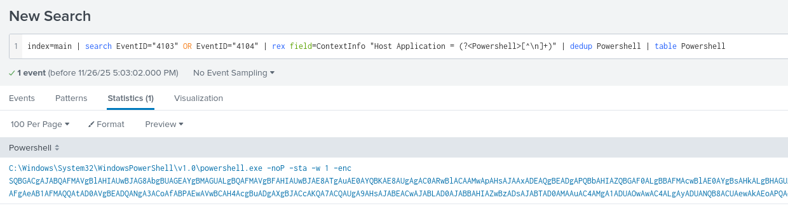

Execution of powershell.exe with **-enc**, means that message is encoded in Base64.  
When copied to Cyber Chef and removing null bytes got some resemblance of URL

``
FroMBASe64StRInG('aAB0AHQAcAA6AC8ALwAxADAALgAxADAALgAxADAALgA1AA==')));$t='/news.php'
``

So i tried to it decode once more

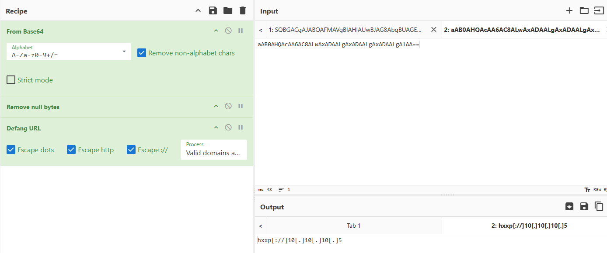

Defanged full URL is:

``
hxxp\[://]10\[.]10\[.]10\[.]5/news\[.]php
``

---

And it this point we reached the end. I hope you liked this write up. Come back for more.
