# ⚔️Pickle Rick 🥒 (TryHackMe's CTF)

A Rick and Morty CTF. Help turn Rick back into a human!

## 📌 Introduction

This Rick and Morty-themed challenge requires you to exploit a web server and find three ingredients to help Rick make his potion and transform himself back into a human from a pickle.

There are three questions we need to answer:

1. What is the first ingredient that Rick needs?
2. What is the second ingredient that Rick needs?
3. What is the third ingredient that Rick needs?

## 🔎 Exploring the Application

We are given the IP address on which a web app is setup. Let us begin by exploring the page. The only thing I found was a clue in the source code.

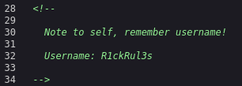

A username: `R1ckRul3s`

We can attempt to locate a robots.txt file, and, surprisingly, there is one. In the file we found a mysterious message

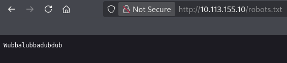

## 📡 Enumeration

A quick scan with wfuzz allowed us to locate the login page.

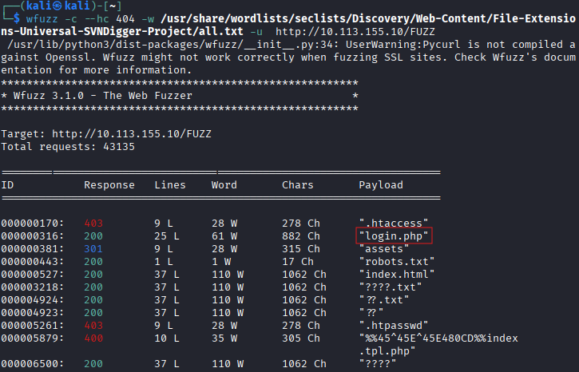

We are greeted with a simple login page.

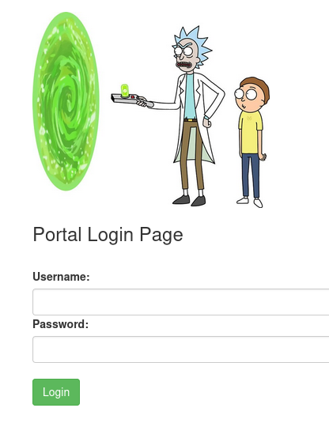

Let's try this combination

* Username: `R1ckRul3s`
* Password: `Wubbalubbadubdub`

To my surprise, it was a match; however, it seemed a little too easy, which made me suspicious.

## 💥 Exploitation

We are greeted with a command panel and a plethora of other bookmarks. Unfortunately, when I attempt to access **Potions**, **Creatures** or **Beth Clone Notes** I am forwarded to `denied.php`

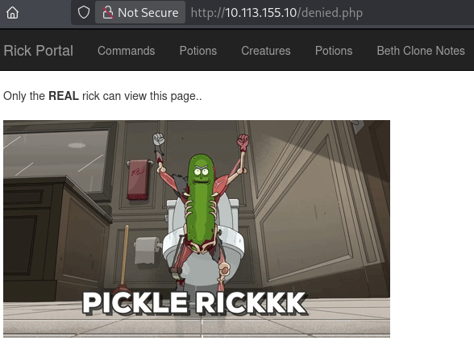

Therefore, I will focus on the **Commands** section.

First a `whoami`, then a `sudo -l`

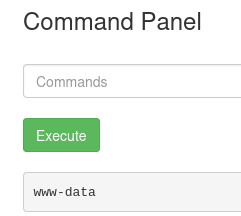

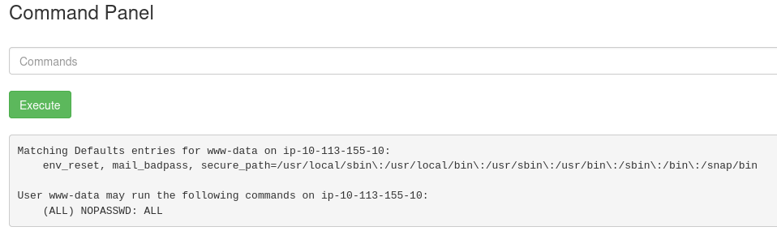

Now we know that we are running as `www-data` user and We have passwordless access to `sudo`.

When entering `ls -la` I obtained a list of files, two of which were particularly noteworthy: **clue.txt** and **Sup3rS3cretPickl3Ingred.txt**.

When trying to use `cat` I am informed that it is disabled

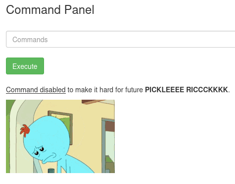

In this case, sudo does not help; therefore, perhaps the `less` command would be effective.

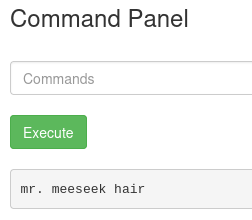

I believe this is the answer to first question.

**The first ingredient is:** mr. meeseek hair

Upon examination, **clue.txt** indeed contained a useful clue.

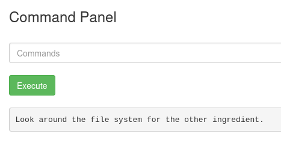

In other directories, the only interesting files were located in `/home/rick`

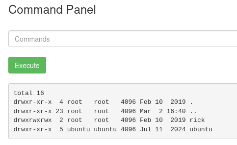

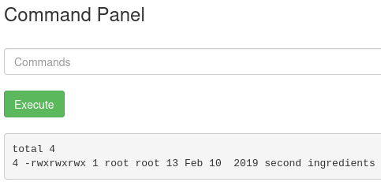

To view this file, we need to take certain precautions. The name of this file contains a space. We need to either use `\` or enclose the path in quotation marks. So `less /home/rick/second\ ingredients` will do the trick.

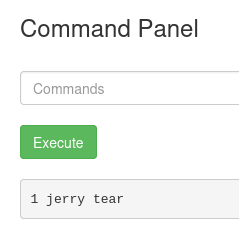

**The second ingredient is:** 1 jerry tear

## 🔐 Privilege Escalation

The remaining question was where the final ingredient could be found. In the "/home/ubuntu" I found nothing and there is one more place, `/root`. With `sudo` permissions, we can view its contents.

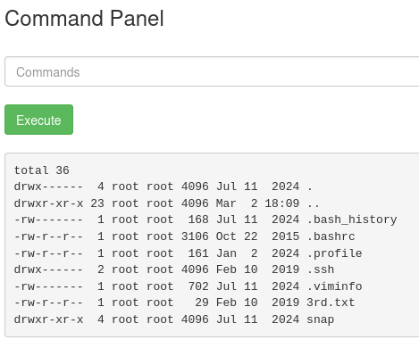

And there it is

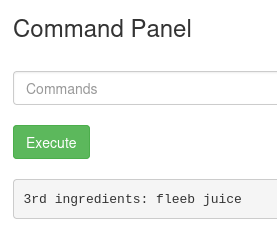

**The third ingredient is:** fleeb juice

## 🧠 Lessons Learned

* Importance of source code inspection
* Checking robots.txt
* Command injection awareness
* File permission analysis

This was an enjoyable and relatively brief challenge, but sometimes you need those to refresh some basic skills. This CTF room is recommended as one for preparations to TryHackMe's PT-1 exam. See you in the next one.
